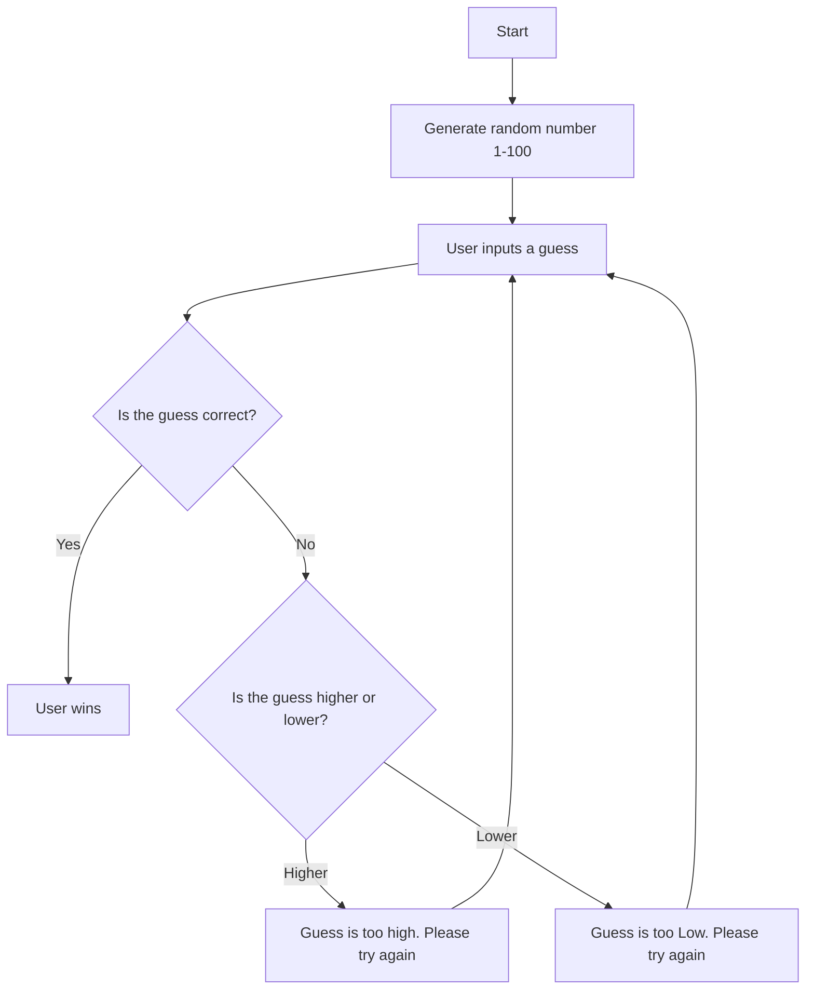

## Game Breakdown  
  - the game starts by generating a random number from 1 to 100
  - the user then replies with their guess
  - the computer then checks the users response with the number it picked as the correct response
  - if the guess is correct, the user automatically wins
  - if the guess is wrong, the computer assesses whether the guess is higher or lower than the correct answer
  - if the guess is higher, the computer responds by saying "Guess is too high. Please try again"
  - if the guess is too low, the computer responds by saying "Guess is too low. Please try again"
  - once the too high or too low response is sent, the user is then sent back to the area where they input their guess
